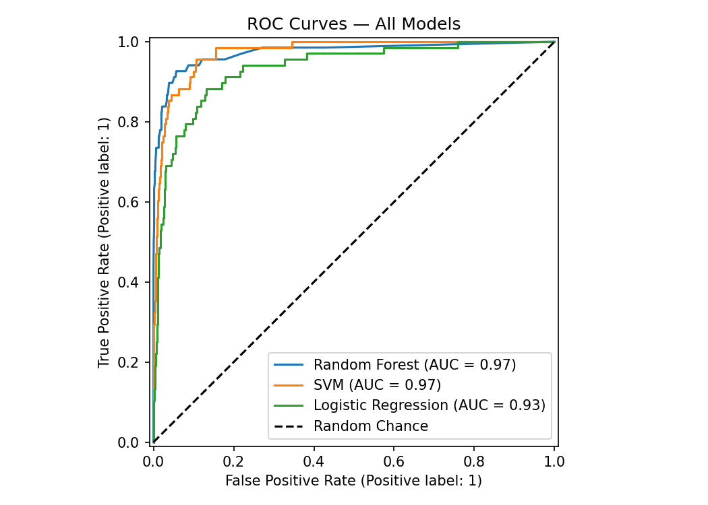
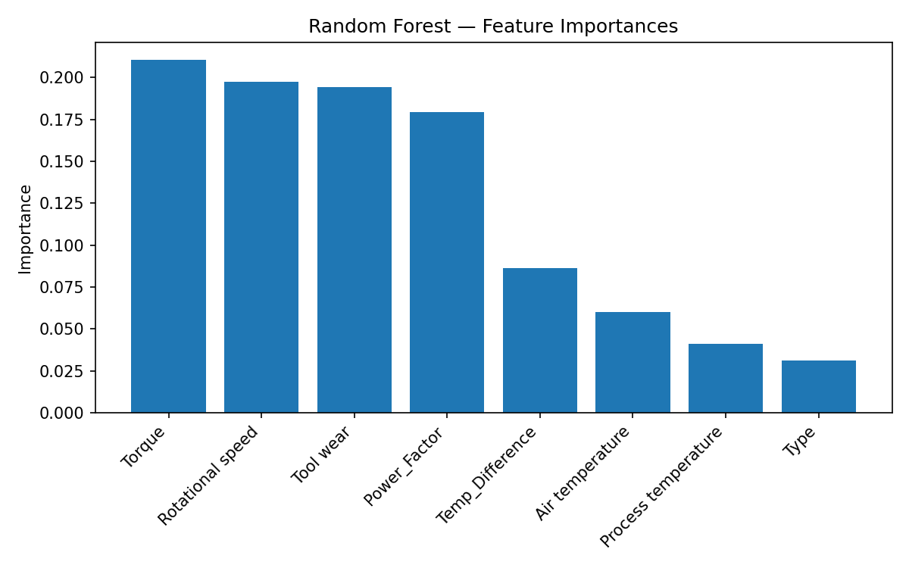

# Methodology

## 1. Dataset

The study uses the **AI4I 2020 Predictive Maintenance Dataset**, a publicly available synthetic dataset
designed to reflect real industrial machine-monitoring conditions. It contains **10,000 records** with
the following attributes:

| Feature | Description | Type |
|---|---|---|
| Type | Machine quality grade: L (low), M (medium), H (high) | Categorical |
| Air Temperature | Ambient air temperature in Kelvin | Numeric |
| Process Temperature | Internal process temperature in Kelvin | Numeric |
| Rotational Speed | Spindle speed in rpm | Numeric |
| Torque | Applied torque in Nm | Numeric |
| Tool Wear | Cumulative tool usage time in minutes | Numeric |
| Machine Failure | Binary target: 1 = failure, 0 = no failure | Binary |

Five sub-failure labels (TWF, HDF, PWF, OSF, RNF) are present in the raw data but are excluded from
modelling; the task is framed as a single binary prediction of `Machine failure`.

The dataset is **severely class-imbalanced**: roughly **3.4 % of records** are labelled as failures,
which is typical of industrial fault data and must be explicitly addressed during preprocessing.

> **Figure 1** — Methodology pipeline overview  
> 

> **Figure 2** — Dataset overview: class distribution, machine types, sub-failure counts, and feature distributions split by failure label  
> 

---

## 2. Data Preprocessing

### 2.1 Cleaning

Duplicate rows and rows with missing values are removed. Because the dataset is synthetic and
well-formed, no records are dropped in practice, confirming data integrity.

### 2.2 Encoding

The categorical feature `Type` (H / L / M) is ordinally encoded to integers using scikit-learn's
`LabelEncoder` (H → 0, L → 1, M → 2). The encoder is serialised so that the same mapping is applied
at inference time inside the web application.

### 2.3 Feature Engineering

Two domain-informed features are derived from the raw sensor readings:

| Engineered Feature | Formula | Rationale |
|---|---|---|
| **Temp Difference** | Process Temperature − Air Temperature | Captures thermal stress on the machine |
| **Power Factor** | Torque × Rotational Speed | Proportional to mechanical power; a proxy for load-induced wear |

Both features are motivated by known industrial failure mechanisms: high thermal gradients accelerate
material fatigue, and excessive power draw correlates with overload failures (PWF, OSF).

> **Figure 3** — Feature engineering diagram showing how original and derived features form the final 8-feature input vector  
> 

### 2.4 Train / Test Split

The dataset is partitioned into **80 % training** and **20 % test** sets using stratified random
sampling (`random_state=42`), preserving the minority-class ratio in both splits.

### 2.5 Feature Scaling

A **RobustScaler** is applied to all eight input features after splitting. RobustScaler centres
features on the median and scales by the interquartile range, making it resilient to the outliers
that commonly appear in sensor data. The scaler is fitted **only on training data** and then applied
to the test set to prevent data leakage.

---

## 3. Handling Class Imbalance — SMOTE

With only ~3.4 % positive examples, a naive classifier can achieve high accuracy simply by
predicting "no failure" for every sample. To address this, **Synthetic Minority Over-sampling
Technique (SMOTE)** is applied to the training set.

SMOTE generates synthetic minority-class examples by interpolating between existing minority
instances in feature space rather than duplicating them, which reduces the risk of over-fitting to
individual minority points. SMOTE is applied **after** the train/test split so that the test set
retains the original class distribution and evaluation reflects real deployment conditions.

> **Figure 4** — Class distribution before and after SMOTE  
> 

---

## 4. Model Selection

Three classifiers spanning a range of complexity and interpretability are trained and compared:

| Model | Rationale |
|---|---|
| **Logistic Regression** | Linear baseline; fast, interpretable, establishes a lower-bound reference |
| **SVM (RBF kernel)** | Non-linear decision boundary; effective in moderate-dimensionality spaces |
| **Random Forest** | Ensemble of decision trees; robust to outliers, provides feature importances |

All models use `class_weight="balanced"` as an additional safeguard against residual class
imbalance that may persist despite SMOTE.

---

## 5. Hyperparameter Optimisation

Hyperparameters are tuned via **GridSearchCV** with **5-fold Stratified K-Fold** cross-validation.
The optimisation objective is the **F1-score** on the minority (failure) class, chosen because it
balances precision and recall and is more informative than accuracy for imbalanced problems.

| Model | Search Space |
|---|---|
| Random Forest | n\_estimators ∈ {100, 200}, max\_depth ∈ {None, 10, 20}, min\_samples\_split ∈ {2, 5} |
| SVM | C ∈ {0.1, 1, 10}, γ ∈ {scale, auto} |
| Logistic Regression | C ∈ {0.01, 0.1, 1, 10}, solver ∈ {lbfgs, liblinear} |

---

## 6. Evaluation Metrics

Each model is evaluated on the held-out test set using six complementary metrics:

| Metric | Formula | Relevance |
|---|---|---|
| **Accuracy** | (TP + TN) / N | Baseline sanity check (misleading with imbalance) |
| **Precision** | TP / (TP + FP) | Cost of false alarms (unnecessary maintenance) |
| **Recall** | TP / (TP + FN) | Cost of missed failures (unplanned downtime) |
| **F1-Score** | 2 · Precision · Recall / (Precision + Recall) | Harmonic mean; primary ranking metric |
| **ROC-AUC** | Area under the ROC curve | Discrimination ability across all thresholds |
| **MCC** | Matthews Correlation Coefficient | Balanced measure for binary classification |

In predictive maintenance the **recall** (sensitivity) is operationally critical — an undetected
failure can cause dangerous and costly unplanned downtime — while precision determines the rate of
false alarms. F1 and MCC jointly capture both.

---

## 7. Results Summary

| Model | Accuracy | Precision | Recall | F1-Score | ROC-AUC | MCC |
|---|---|---|---|---|---|---|
| **Random Forest** | **0.9735** | **0.5824** | 0.7794 | **0.6667** | **0.9740** | **0.6607** |
| SVM | 0.9350 | 0.3278 | **0.8676** | 0.4758 | 0.9737 | 0.5098 |
| Logistic Regression | 0.8635 | 0.1846 | 0.8824 | 0.3053 | 0.9338 | 0.3661 |

> **Figure 5** — Model comparison across all evaluation metrics  
> 

**Random Forest** achieves the best F1-score (0.667), ROC-AUC (0.974), and MCC (0.661), making it
the recommended model for deployment. SVM attains the highest recall (0.868), making it suitable
when the priority is minimising missed failures regardless of false-alarm rate. Logistic Regression
serves as a transparent baseline.

> **Figure 6** — ROC curves for all models  
> 

> **Figure 7** — Random Forest feature importances  
> 

The feature importance analysis (Figure 7) reveals that **Tool Wear**, **Torque**, and the
engineered **Power Factor** are the three most predictive signals, validating the feature
engineering step.

---

## 8. Deployment

The full pipeline — preprocessing, all trained models, and the scaler and encoders — is packaged
into an interactive **Streamlit** web application (`app/app.py`). The app provides:

- Dataset overview and class-distribution visualisations
- Side-by-side model comparison with interactive metric selection
- Confusion matrices and ROC curves for each model
- A **live prediction interface** where operators enter real-time sensor readings and receive an
  instantaneous failure probability from any of the three models

The pipeline is orchestrated end-to-end by `run_pipeline.py`, which calls preprocessing, training,
and evaluation in sequence so that results are fully reproducible from a single command.
